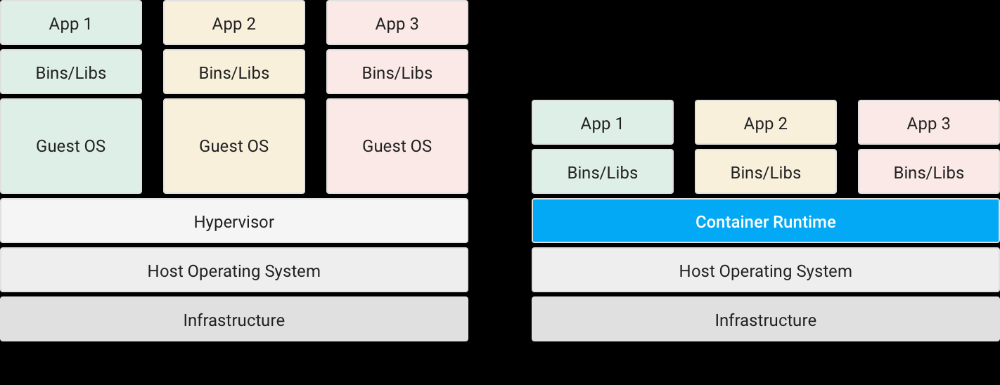

# 컨테이너

## 컨테이너란?
컨테이너는 애플리케이션을 실제 구동 환경으로부터 추상화할 수 있는 논리 패키징 메커니즘을 제공합니다. 이러한 분리를 통해 사설 데이터 센터나 퍼블릭 클라우드, 심지어 개발자의 개인 노트북 컴퓨터에 이르기까지 어떤 환경으로든 컨테이너 기반 애플리케이션을 쉽게 지속적으로 배포할 수 있습니다. 또한 컨테이너화를 통해 업무 영역을 깔끔하게 분리할 수 있습니다. 즉, 개발자는 애플리케이션의 로직과 종속 항목에 집중하고, IT 운영팀은 특정 소프트웨어 버전, 개별 앱 구성과 관련한 세부 업무에 시간을 낭비하지 않고 배포 및 관리에 집중할 수 있습니다.

 

가상 환경에 익숙하다면 컨테이너를 가상 머신(VM)에 비교하여 생각하면 이해하기 쉽습니다. VM의 개념은 이미 익히 알고 계실 것입니다. 호스트 운영체제에서 구동되며 그 바탕이 되는 하드웨어에 가상으로 액세스하는 Linux, Windows 등의 게스트 운영체제를 의미합니다. 컨테이너는 가상 머신과 마찬가지로 애플리케이션을 관련 라이브러리 및 종속 항목과 함께 패키지로 묶어 소프트웨어 서비스 구동을 위한 격리 환경을 마련해 줍니다. 그러나 아래에서 살펴보듯 VM과의 유사점은 여기까지입니다. 컨테이너를 사용하면 개발자와 IT 운영팀이 훨씬 작은 단위로 업무를 수행할 수 있으므로 그에 따른 이점이 훨씬 많습니다.

 

 

# 컨테이너를 사용해야 하는 이유

 

가상 머신은 하드웨어 스택을 가상화합니다. 컨테이너는 이와 달리 운영체제 수준에서 가상화를 실시하여 다수의 컨테이너를 OS 커널에서 직접 구동합니다. 컨테이너는 훨씬 가볍고 OS 커널을 공유하며, 시작이 훨씬 빠르고 OS 전체 부팅보다 메모리를 훨씬 적게 차지합니다.

## 그래서 뭐가 좋은데?

### 😃 일관성 있는 환경

 

개발자는 컨테이너를 이용해, 다른 애플리케이션과 분리된 예측 가능한 환경을 생성할 수 있습니다. 컨테이너는 애플리케이션에 필요한 소프트웨어 종속 항목(프로그래밍 언어 런타임 및 기타 소프트웨어 라이브러리의 특정 버전 등)도 포함할 수 있습니다. 개발자의 관점에서 이 모든 요소는 애플리케이션이 배포되는 최종 위치에 관계없이 항상 일관성이 있습니다. 그 결과 자연히 생산성이 향상될 수밖에 없습니다. 개발자와 IT 운영팀이 버그를 잡고 환경 차이를 진단하던 시간을 줄이고 사용자에게 신규 기능을 제공하는 데 집중할 수 있기 때문입니다. 또한 개발자가 개발 및 테스트 환경에서 세운 가정이 프로덕션 환경에서 그대로 실현될 것이기 때문에 버그 수 자체도 감소합니다.

### 😎 폭넓은 구동 환경

 

컨테이너는 Linux, Windows, Mac 운영체제, 가상 머신, 베어메탈, 개발자의 컴퓨터, 데이터 센터, 온프레미스 환경, 퍼블릭 클라우드 등 사실상 어느 환경에서나 구동되므로 개발 및 배포가 크게 쉬워집니다.

 

### 😤 격리

 

컨테이너는 CPU, 메모리, 스토리지, 네트워크 리소스를 OS 수준에서 가상화하여 개발자에게 기타 애플리케이션으로부터 논리적으로 격리된 OS 샌드박스 환경을 제공합니다.  

 

<strong> VM은 하드웨어 스택을 가상화하는 것과 달리 컨테이너는 운영체제 수준에서 가상화하기 때문에 오버헤드가 작습니다. </strong>

 

||컨테이너의 이점|가상 머신의 이점|
|------|---|---|
|일관성 있는 런타임 환경|∨|∨|
|애플리케이션 샌드박스화|∨|∨|
|디스크 용량 절감|∨ | |
|낮은 오버헤드| ∨|

 

# 코드에서 애플리케이션으로

출처 : https://cloud.google.com/containers/?hl=ko