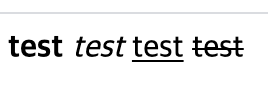
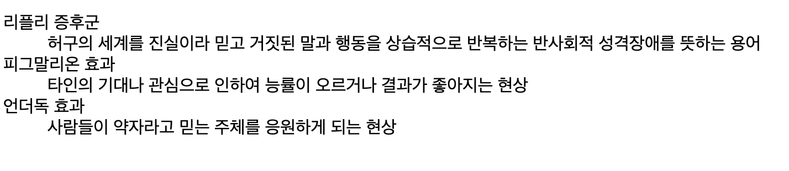
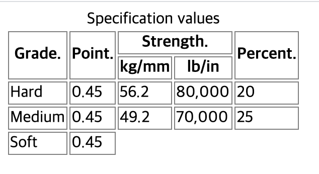
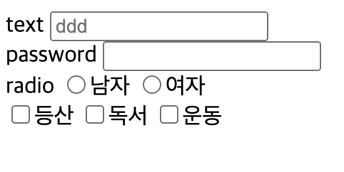
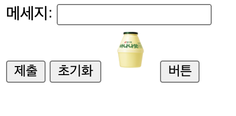
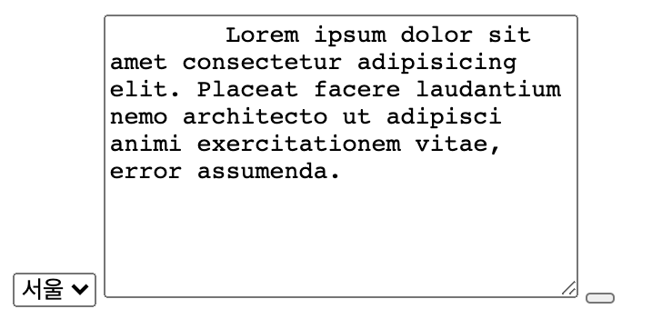

# HTML 태그

# 제목과 단락 요소

## Heading 태그 (h1 ~ h6)
```
<h1>역사</h1>
<h2>개발</h2>
1980년, 유럽 입자 물리 연구소(CERN)의 계약자였었던 물리학자 팀 버너스리가 HTML의 원형인 인콰이어를 제안하였다.
... 이하 생략
<h2>최초 규격</h2>
HTML 최초의 일반 공개 설명은 1991년 말에 버너스리가 처음으로 인터넷에서 문서를 "HTML 태그"(HTML tag)로 부르면서 시작되었다.
... 이하 생략
```
- 숫자가 작을수록 크기가 큽니다.
## paragraph
```
p>
    HTML 최초의 일반 공개 설명은 1991년 말에 버너스리가 처음으로 인터넷에서 문서를 "HTML 태그"(HTML tag)로 부르면서 시작되었다.
    ... 이하 생략
</p>
```
- 단락별로 개행됩니다.
[소스코드](src/test1.html)

# 텍스트를 꾸며주는 요소
- \<b> : 글자를 굵게 표현한다.
- \<i> : 글자를 기울지게 표현한다.
- \<u> : 글자에 밑줄이 그어집니다.
  - HTML5 버전에서는 단순 표현용 태그에서 의미를 가지는 태그로 변경되었습니다.
- \<s> 글자의 중간선을 푷녀하는 태그입니다.(예전에 존재했던 strike 태그 와는 다른 태그입니다.) 

```
    <b>test</b>
    <i>test</i>
    <u>test</u>
    <s>test</s>
```


# 앵커 요소
- HTML에서 HT(Hyper Text)는 링크를 의미하는 것으로, 링크는 클릭하기만 하면 다른 페이지로 쉽게 이동할 수 있습니다.
- 앵커 태그는 이런 <u>링크</u>를 생성합니다. 앵커 태그를 이용해 다른 페이지로 이동하거나 현재 페이지 내에서 특정 위치로 초점을 이동시킬 수 있습니다.

## \<a>
```
<a href="http://www.naver.com/" target="_blank">네이버</a>
```
- href
  - href : 링크를 만들기 위해 \<a>는 반드시 href(hypertext reference) 속성을 가지고 있어야 합니다.
  - href 속성의 값은 링크의 목적지가 되는 URL 입니다.
- target 속성
  - 링크된 속성은 링크된 리소스를 어디에 표시할지 나타낸다
  - _self : 현재화면 표시
  - _blank : 새로운 창에 표시

## 내부링크
- \# <- id 속성
- 해당아이디로 이동할 수 있습니다.
[소스코드](src/test3.html)
```
<!DOCTYPE html>
<html lang="en">
<head>
    <meta charset="UTF-8">
    <meta name="viewport" content="width=device-width, initial-scale=1.0">
    <title>Document</title>
    <link rel="stylesheet" href="reset.css">
    <style>
        body{
        position: relative;
        height: 2000px;}

        #move{
            position : absolute;
            bottom: 0;
        }
    </style>
</head>
<body>
    <a href="www.naver.com" target="_blank">네이버</a>
    <br>
    <a href="#move">이동하기</a>

    <div id="move">
        바닥입니다.
    </div>
</body>
</html>
```

# 의미가 없는 컨테이너 요소
- 태그자체에 의미가 없습니다.
- 단순히 요소들을 묶기 위해 사용되는 태그입니다.
- 스타일을 주거나 서버에 보내는 데이터를 담기 위한 용도로 이런 의미 없는 요소들이 사용됩니다.
- \<div> 와 \<span> 이 대표적입니다.

# 리스트 요소
- 리스트는 일련된 항목들이 나열된 것들을 의미합니다.
- ui
- ol
- dl

## \<ul>
ul(unordered list) 태그는 순서가 없는 리스트를 표현할 때 사용합니다.
```
<ul> 
    <li> 콩나물</li> 
    <li> 파</li> 
    <li> 국  간장</li> 
    ... 
</ul> 
```

## \<ol>
ol(ordered list)태그는 순서가 있는 리스트를 표현할 때 사용합니다.
```
<ol>
    <li>냄비에 국물용 멸치를 넣고 한소끔 끓여 멸치 육수를 7컵(1,400ml) 만든다.</li>
    <li>콩나물을 넣고 뚜껑을 덮어 콩나물이 익을 때까지 끓인다.</li>
    <li>뚜껑을 열고 대파, 마늘, 고춧가루를 넣고 끓인다.</li>
    ...
</ol>
```

## \<dl>태그
dl(definition/description list) 태그는 용어와 그에 대한 정의를 표현할 때 사용합니다.
- \<dt> : 용어를 나타내는 태그
- \<dd> : 용어에 대한 정의 또는 설명
- 용어 하나에 여러 정의가 들어갈 때, \<dd>를 여러개 사용합니다.

```
<dl>
    <dt>리플리 증후군</dt>
    <dd>허구의 세계를 진실이라 믿고 거짓된 말과 행동을 상습적으로 반복하는 반사회적 성격장애를 뜻하는 용어</dd>
    <dt>피그말리온 효과</dt>
    <dd>타인의 기대나 관심으로 인하여 능률이 오르거나 결과가 좋아지는 현상</dd>
    <dt>언더독 효과</dt>
    <dd>사람들이 약자라고 믿는 주체를 응원하게 되는 현상</dd>
</dl>
```


# 이미지 요소

## \는 문서에 이미지를 삽입하는 태그로, 닫는 태그가 없는 빈 태그 입니다.
```

```
- src 속성 : 이미지의 경로
- alt : 이미지의 대체 텍스트를 나타내는 속성
- width/height 속성
- 상대경로와 절대경로

```
<!-- 상대경로 -->


<!-- 절대경로 -->


```
- gif : 제한적인 색을 사용하고 용량이 적으며 투명 이미지와 애니메이션 이미지를 지원하는 형식
- jpg : 사진이나 일반적인 그림에 쓰이며 높은 압축률과 자연스로운 색상 표현을 지원하는 형식
- png : 이미지 손실이 적으며 투명과 반투명을 모두 지원하는 형식

[소스코드](./src/test5.html)

# 테이블 요소 1
- \<table>: 표를 나타내는 태그
- \<tr>: 행을 나타내는 태그
- \<th>: 제목 셀을 나타내는 태그
- \<td>: 셀을 나타내는 태그

[소스코드](./src/test6.html)

## 표의 구조와 관련된 태그
- \<caption> : 표의 제목을 나타내는 태그
- \<thead> : 제목 행을 그룹화하는 태그
- \<tfoot> : 바닥 행을 그룹화하는 태그
- \<tbody> : 본문 행을 그룹화하는 태그


[소스코드](./src/test7.html)
- HTML4: <tfoot> 위치가 <tbody> 전에 위치합니다. 이유는 데이터의 양이(<tbody>) 잠재적으로 매우 클수도 있기 때문에 그 전에 <tfoot>을 렌더해야 했기 때문입니다.
- HTML5:  <tfoot>의 위치가 <tbody> 앞에 와도 되고, 뒤에 와도 상관없습니다.
- HTML5.1 ~ 현재(5.2): <tfoot>이 <tbody> 뒤에 위치해야 합니다. <tfoot>의 위치가 <tbody> 앞에 나올 경우 웹 접근성의 키보드의 초점 이동 순서 항목에 문제가 있기 때문에 변경되었습니다.

# 테이블 요소 2
```
<table>
  <caption>Specification values</caption>
  <thead>
  <tr>
    <th rowspan="2">Grade.</th>
    <th rowspan="2">Point.</th>
    <th colspan="2">Strength.</th>
    <th rowspan="2">Percent.</th>
  </tr>
  <tr>
    <th>kg/mm</th>
    <th>lb/in</th>
  </tr>
  </thead>
  <tbody>
  <tr>
    <td>Hard</td>
    <td>0.45</td>
    <td>56.2</td>
    <td>80,000</td>
    <td>20</td>
  </tr>
  <tr>
    <td>Medium</td>
    <td>0.45</td>
    <td>49.2</td>
    <td>70,000</td>
    <td>25</td>
  </tr>
  <tr>
    <td>Soft</td>
    <td>0.45</td>
  </tr>
```


# 폼 요소 1
https://developer.mozilla.org/en-US/docs/Web/HTML/Element/input

```
<!DOCTYPE html>
<html lang="en">
<head>
    <meta charset="UTF-8">
    <meta name="viewport" content="width=device-width, initial-scale=1.0">
    <title>Document</title>
</head>
<body>
    text
   <input type="text" placeholder="ddd">
   <br>
   password
   <input type="password">
   <br>
   radio
   <input type="radio" name ="gender">남자 
   <input type="radio" name ="gender">여자 <br>

   <input type="checkbox" name="hobby">등산
   <input type="checkbox" name="hobby">독서
   <input type="checkbox" name="hobby">운동
</body>
</html>
```


# 폼 요소 2
```
<!DOCTYPE html>
<html lang="en">
<head>
    <meta charset="UTF-8">
    <meta name="viewport" content="width=device-width, initial-scale=1.0">
    <title>Document</title>
</head>
<body>
    <form action="#">
    메세지: <input type="text" name="message"><br>
    <input type="submit">
    <input type="reset">    
    <input type="image" src="./images/bing-milk.jpg" alt="click" width="50" height="50">
    <input type="button" value="버튼">
</form>
</body>
</html>
```

- submit : form의 값을 전송하는 버튼
- reset : form의 값을 초기화하는 버튼
- image : 이미지를 삽입할 수 있는 버튼(submit과 동작이 동일함)
- button : 아무 기능이 없는 버튼

# 폼 요소 3
```
    <select name="location" id="location">
        <option value="서울">서울</option>
        <option value="부산">부산</option>
        <option value="대전">대전</option>
    </select>

    <textarea name="" id="" cols="30" rows="10">
        Lorem ipsum dolor sit amet consectetur adipisicing elit. Placeat facere laudantium nemo architecto ut adipisci animi exercitationem vitae, error assumenda.
    </textarea>

    <button type="submit|reset|button"></button>
</body>
```


# 폼 요소 4
- label
- fieldset
- legend
- form

## \<label>
\<label>은 form 요소의 이름과 form 요소를 명시적으로 연결시켜주기 위해 사용합니다. <br>
모든 form 요소에 사용할 수 있습니다.
- form 요소의 id 속성값과 \<label>의 for 속성값을 같게 적어주어야 합니다.
- \<label>을 사용하면 이를 클릭했을 경우 해당 form 요소를 클릭한 것처럼 동작합니다.
- 스크린 리더기를 통해 듣게 되면 해당 form 요소에 접근시 \<label>을 함께 읽어줍니다.
- \<label>은 사용성,접근적인 측면으로 중요한 역할을 하므로 반드시 써주는 것이 좋습니다.

## \<fieldset> ,\<legend>
- fieldset : 여러 개의 폼 요소를 그룹화하여 구조적으로 만들기 위해 사용
- legend : 폼 요소의 제목으로 \<fieldset> 내부에 작성

## form
- form 요소들을 감싸는 태그로 묶어서 실제 서버로 전송해주는 역할을 하는 태그
- action : 데이터를 처리하기 위한 서버의 주소
- method : 데이터를 전송하는 방식을 지정
- get : 데이터가 노출
- post : 데이터가 노출되지 않는다.
  
[소스코드](./src/test12.html)
