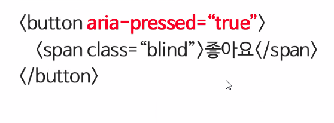
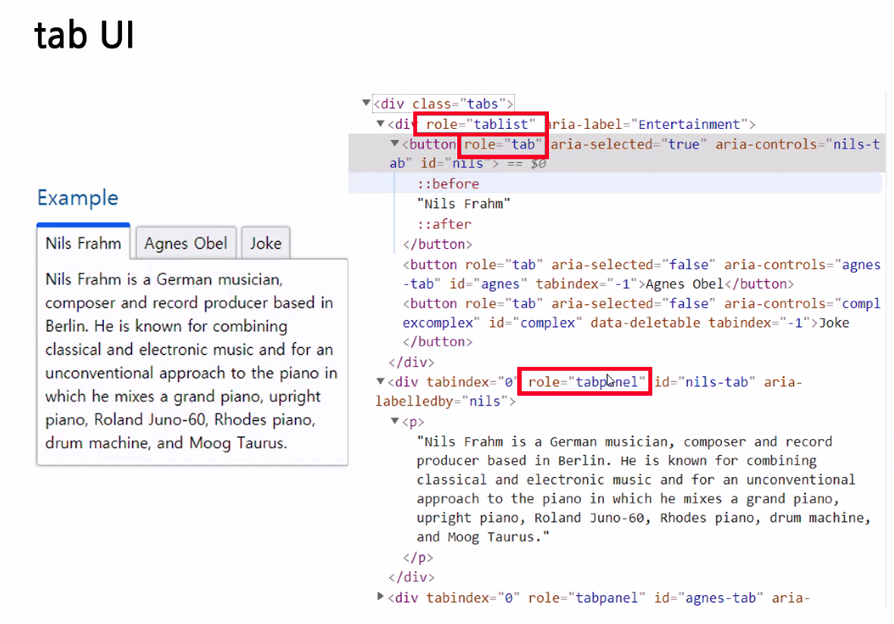
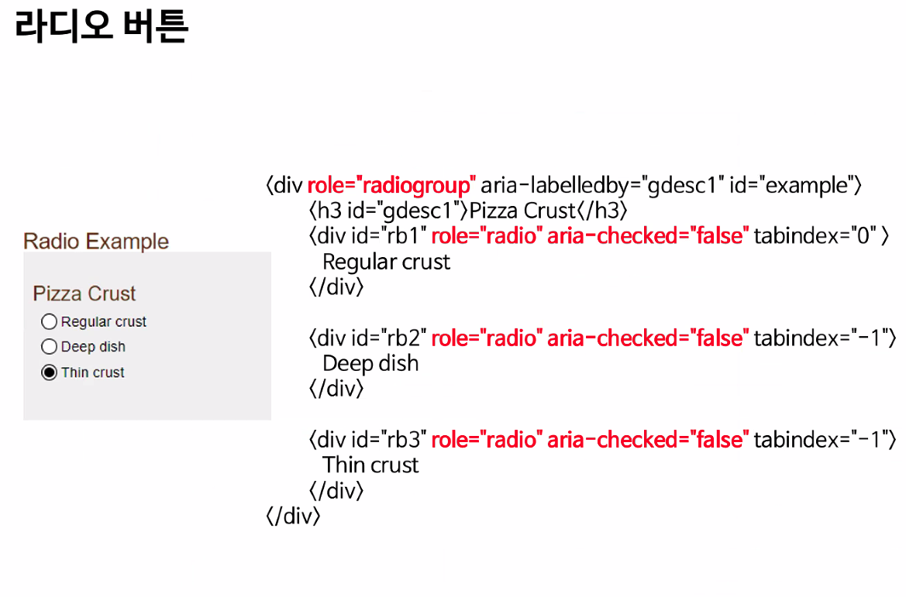

# 접근성 교육
- 구글에 : 네이버 접근성 사이트 
- accessibility.naver.com
- blind 메뉴얼 제공합니다.
- NULI 사이트 : nuli.navercorp.com
- LINK 사이트 : link.navercorp.com (내부적으로 사용하는 사이트)
## 웹 접근성이란?
- 모든 기기에서 모든 사용자가 웹 정보를 습득 가능하도록!

# LINK
- 접금성 진단 

# 접근성 개선 프로세스
- 사용자 : 불편접수
- 접근성팀 : 전문가 및 사용성 찐단, 이슈 및 해결 방안 리포트
- 서비스팀 : 일정 확보 후 접근성 개선 진행

# WAI-ARIA (웨이아리아)
- javascript 및 관련 기술로 개발된 사용자 인턴페이스 구성 요소의 접근성을 증가시키는 방법

## 결론 : 마크업에서 접근성을 준수하는데 한계가 있는 경우 보조적으로 접근성을 준수할 수 있도록 준수
- 구성 : Role, State, Property

# Role
- 요소역할을 정의
- button, checkbox,link,option,radio,switch,textbox,treeitem ...
- \
 \<a href="#" role="button">좋아요</a>

# 상태와 속성
- aria-invalid, aira-checked, aria-level
- \<button ara-pressed="true">좋아요</button>
- \<a href="#" role="slider" aria-orientation ="vertical">홈\</a>

## 링크와 버튼
- 링크 : 페이지가 변경되거나 페이지 내부에 위치가 변경될 때 사용
- 버튼 : 페이지 내에서 동작할 때 사용

## 확장 / 축소
- \<button aria-expanded="false">테마\</buton>
- \<a href="#" role="button" aria-expanded="false">테마\</a>
- <mark> a 태그 같은경우 리더기가 읽을 수있게 스페이스바로도 선택가능하게 해주어야함 </mark>
- \<button>테마\확장\\</button>

## 팝업
- 하이메뉴 
- \<button aria-haspopup="true"> 공유 \</button>

## 토글 버튼

## tab UI
- 컨텐츠 선형 구조를 지켜야합니다.

- 아리아를 쓸거면 이렇게 세부적인것들을 다사용해야합니다.
- 선형구조

## 라디오 버튼

## 결론
WAI-ARIA는 태그로 접근성을 준수하지 못할 경우에 사용한다. 
