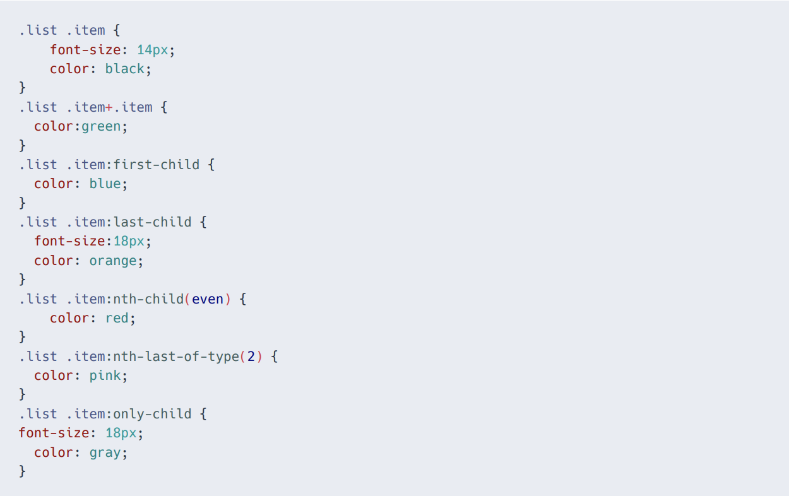
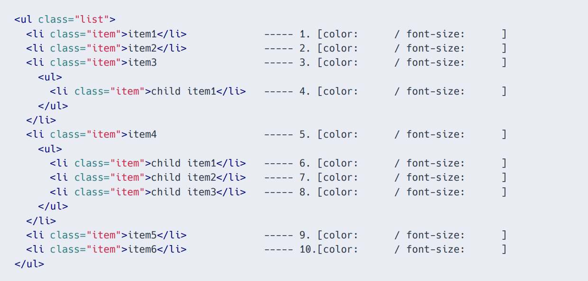
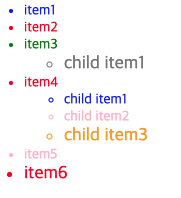
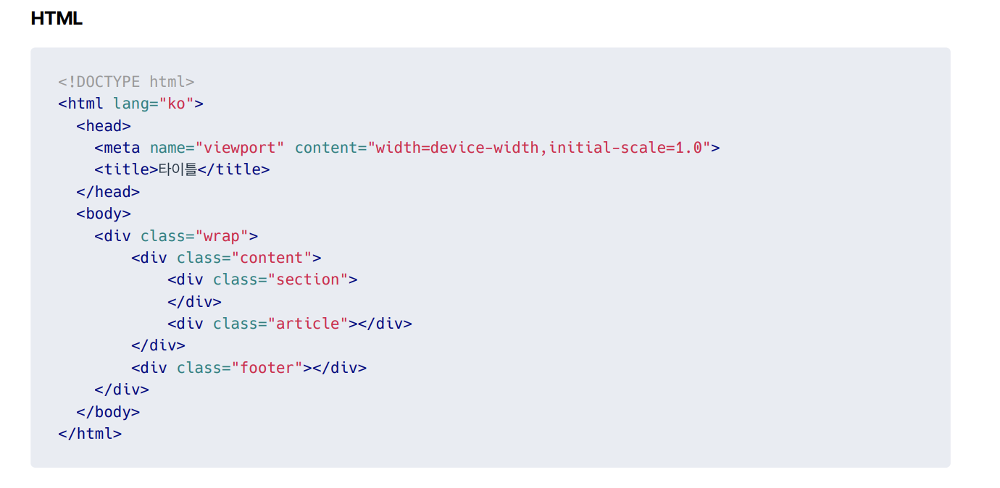
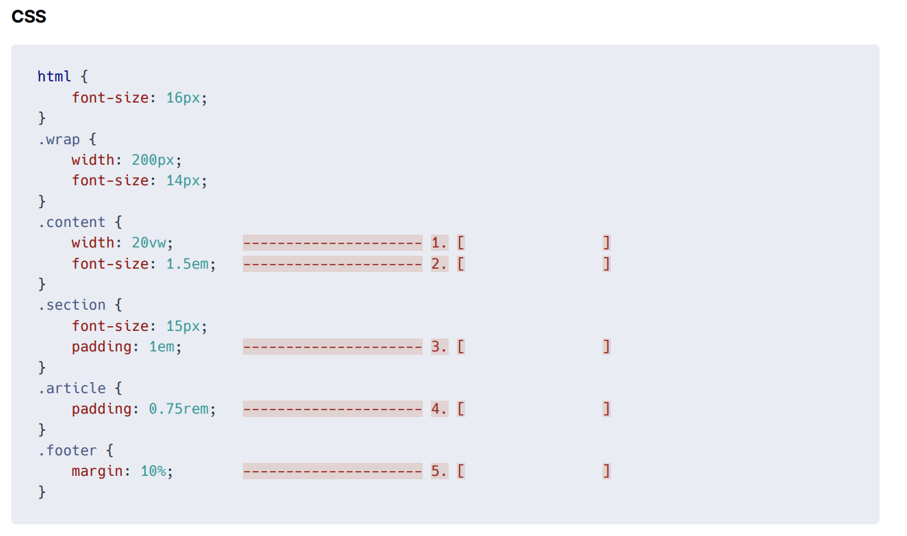

# 서술형1



```
밑에서부터 채워나가면 쉬움.

.list .item:only-child 속성은 요소내에 .item을 가지는 형제 태그가 없이 오직 하나만 존재할경우를 말한다. 따라서 4번째는 18px/gray 고정이다.
 // only-child는 각요소 유일 only-of-type은 같은 유형의 형제가 없을겨우
  
  다음으로 .list .item:nth-last-of-type(2) item 클래스형제중에서 끝에서 두번째녀석을 의미한다. 따라서 9번 7번의 색깔은 pink가 된다. (크기는 정해지지 않음.)

  .list .item:nth-chid(even)은 말그대로 짝수번째를 의미한다.
  2번, 5번, 7번, 10번이 후보다. (7번은 앞에서 뽑혓으니) 2 , 5 , 10은 붉은색으로 고정이다. (font는 아직 정해지지 않음)

  .list .item:last-child 말그대로 마지막 item 요소이다.
  4번 8번 10번 이다. , 4번은 이미 선택했고, 8번, 10번의 크기가 18px로 정해지고 
  10번은 앞선 색갈이 뽑혓으니 8번은 orange/18px이 적용된다.

  .list .item:first:child는 첫번째 요소를 선택한다.
  1번, 4번, 6번이 후보이다. 4번은 이밉뽑혓으니 1번과 6번의 색갈을 푸른색으로 만든다.
  (font-size는 정해지지 않음)

  .list .item+ .item 형제 선택자는 2,3,7,8,10 이 후보다.
  3번을 제외하고는 색갈이 그려졌으니 3번은 green이다.
  
  .list .item 속성으로 전체적으로 검은색을 하지만 이미 색상을 다정해졌고 font-size가 없는 요소에 14px이 적용된다.
```


# 서술형 4
```
<!DOCTYPE html>
<html>

<head>
    <meta charset="UTF-8">
    <title>네이버</title>
</head>

<body>
    <h1>
        <div>네이버</div>
    </h1>
    <ul>
        <li><a href="#">
                <div>메뉴1</div>
            </a>
        <li><a href="#"><span>메뉴2</span></a>

        <li><a href="#"><em>메뉴3</em></a>
    </ul>
    <span>
        <p>메일</p>
    </span>
    <span><em>카페</em></span>
    <p>
    <div>블로그</div>
    </p>
</body>

</html>
```
- lang="ko"
- h1안에 div사용불가
- span 안에 p 사용불가
- p 안에 div 사용불가

# 서술형 5



```
1. vw는 뷰포트기준 넙이 20% 이기 때문에 360 * 0.2 = 72적용
2. 14 * 1.5 = 21임...하..
3. 15px이 적용됨 em은 현재 font-size기준인듯
4. 12px rem 기준이므로 12가적용된다.
5. 20px 상위 부모의 기준인 200에서 10% = 20px;
```

# 서술형 6번의
```
    font: italic bold 18px/22px '돋움',Dotum,sans-serif;
    font-style: italic;
    font-weight: bold;
    font-size: 18px;
    line-height: 22px;
    font-family: '돋움', Dotum, sans-serif;
```

# 서술형 7번
```
새창 "_blank"
현재창 "self"

blank :  기존의 창은 그대로이고 새로운 인터넷 창하나를 더 띄워서 거기에 링크된 페이지를 연다.
((ex))  <a href="aaa.html" target="_blank">링크</a>


self : 기존에 떠있는 자기 창에다가 링크된 페이지를 연다.
((ex))  <a href="aaa.html" target="_self">링크</a>


parent : 기존창의 바로 전창에다가 링크된 페이지를 연다. 만약에 인터넷창을 3개 열어 두었다고 하면 1, 2, 3 이렇게 열었다고 하면 3번창에서 parent속성의 태그링크를 클릭하면 바로 전에 열었던 2번 창에 페이지가 표시된다.
((ex))  <a href="aaa.html" target="_parent">링크</a>


top : 현재 열려있는 최상위 인터넷창에다가 페이지를 연다.
((ex))  <a href="aaa.html" target="_top">링크</a>
```
# 서술형 8번
```
    background: #fff url(image.gif) no-repeat 100% 0;
    background-color : #fff;
    background-image: url(image.gif);
    background-repeat : no-repeat;
    background-position : 100% 0;
```