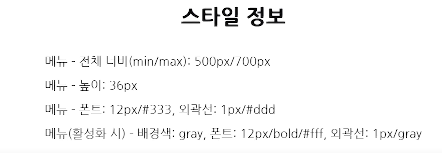

# 크로스 브라우징
- 어떤 브라우저를 쓰더라도 똑같은 화면이 나와야합니다.

# CSS Reset
- 각 프로젝트에 맞춰서 사용한다.
- https://cssreset.com

## 정리
- 브라우저마다 태그를 렌더링하는 기본 스타일이 다르다.
- 모든 브라우저에서 동일한 화면을 볼 수 있도록 기본값을 초기화한다.
- reset CSS는 각 프로젝트에 맞춰서 사용한다.

# IR 기법
- Image Replacement
- 이미지를 볼 수 없는 사람들에게 적절한 텍스트를 제공해야합니다.


## 이미지 사용방법
- \ 는 서버에서 이미지를 내려주는 경우 사용
- \<i> 안에 백그라운드 컬러를 처리한다. 
- 이미지의 텍스트가 너무긴 경우에도 IR 기법을 많이 사용한다.

## 시멘틱 마크업 + CSS로 요소를 화면에서 숨김 + 스크린 리더가 인식

### BAD
- visibility : hidden;
- display : none;
- width: 0; height:0; font-size:0; line-height:0;

### SOSO
- opacity :0;
- text-indent : -9999px;
- z-index: -1;

### BEST
- blind
```
  <!-- 레이아웃에 영향을 끼치지 않도록 -->
    position: absolute;
    <!-- 스크린 리더가 읽을 수 있도록 -->
    width: 1px;
    height: 1px;
    <!-- 눈에 보이는 부분을 제거 -->
    overflow: hidden;
    margin: -1px;
    clip: rect(0, 0, 0, 0);
```
- top을 안쓰고 margin을 쓰는 이유는 relative가 어디있느야에 따라서 영역의 크기를 더 잡아 먹을 수 있기 때문입니다.

## 정리
- img 태그 사용 시 , 대체 텍스트가 너무 긴 경우
- 배경 이미지로 처리한 의미 있는 태그가 너무 긴 경우

# float의 해제
- 부모요소 height 부여
- 부모요소 float 속성포함
- 부모요소의 overflow 속성
- 뒤에 인접하는 형제요소의 clear 속성
- 가상요소를 이용한 clear 속성

# Layout
- 책이나 신문, 잡지 따위에서 글이나 그림 따위를 효과적으로 정리하고 배치하는 일
- 정원 따위의 설계를 이르는 말

# 1단 레이아웃
- header
- content
- footer
- 네이버 쇼핑, 네이버 사전, 네이버 포스트

# 2단 레이아웃
- header , aside , content, footer
- header , visual, content, aside, footer
- 네이버 뮤직, 네이버 날씨 

# 3단 레이아웃
- header, aside, content, aside, footer

# Fixed 레이아웃
- 상단 고정
- 하단 고정
- 상하단 고정
# Menu 란?
- 내비게이션
- 웹사이트에서 제공되는 정보를 쉽게 찾을 수 있도록 도와준다.
- 1단 메뉴
- 2단 메뉴
- 좌측 메뉴


# TAP
## 색인
- 색인 또는 목록이라는 의미이며, 데이터를 기록할 경우 그 데이터의 이름, 데이터의 크기 등의 속성과 그 기록 장소 등을 표로 표시하는 것, 즉 참조용 데이터를 색인표 또는 인덱스라고 합니다.
- 여러 문서 또는 패널을 하나의 창에 두고 전환하여 볼 수 있도록 한 인터페이스

# 탭과 내빅이션의 차이
- 내비게이션 : 다른 화면으로 이동
- 탭 : 화면 이동 없이 선택한 탭과 연관된 콘텐츠가 보임

## 탭 UI로 만들어진 사이트
- 네이버뉴스 사이트 (가장 많이 본 뉴스 : 우측)
- 네이버 만화(인기급상승 만화 : 우측)
```
    position: absolute;
    z-index: -1;
    color: transparent;
```

# Image List 란?
- 이미지 리스트는 다른 말로 섬네일 리스트라고도 불립니다.
- 섬네일의 사전적 의미로는 엄지 손톱, 작은 물건이라는 뜻을 가지고 있습니다.
- 인터넷에선 작은 크기의 견본 이미지를 가리켜 섬네일이라고 부릅니다.

# 텍스트 말줄임
- 말줄임을 하기위해서는 고정너비를 가져야합니다.
```
overflow ; hidden;
text-overflow: ellipsis;
white-space:nowrap;
```


## 텍스트 말줄임
```
<p class="elip1">가나다라마바사아자차카타파하가나다라마바사아자차카타파하가나다라마바사아자차카타파하</p>
<p class="elip2">가나다라마바사아자차카타파하가나다라마바사아자차카타파하가나다라마바사아자차카타파하</p>
<p class="elip3">가나다라마바사아자차카타파하가나다라마바사아자차카타파하가나다라마바사아자차카타파하</p>
```
```
p {
  width: 200px;
  background-color: yellow;
  font-size: 16px;
  line-height: 20px;
}
.elip1 {
  overflow: hidden;
  text-overflow: ellipsis;
  white-space: nowrap;
}
.elip2 {
  max-height: 40px; /* webkit 외 브라우저 대응, line-height*line수 */
  overflow: hidden;
  text-overflow: ellipsis;
  display: -webkit-box;
  -webkit-box-orient: vertical;
  -webkit-line-clamp: 2;
}
.elip3 {
  max-height: 60px; 
  overflow: hidden;
  text-overflow: ellipsis;
  display: -webkit-box;
  -webkit-box-orient: vertical;
  -webkit-line-clamp: 3;
}
```
## 이미지 액자 효과
```
<div class="img_wrap">
  
<div>

```
```
.img_wrap {
  position: relative;
  width: 200px;
  height: 134px;
}
.img_wrap:after {
  position: absolute;
  top: 0;
  right: 0;
  bottom: 0;
  left: 0;
  content: '';
  border: 1px solid rgba(0, 0, 0, 0.3);
  background-color: rgba(0, 0, 0, 0.15);
}
```

## 요소 감추기
```
position: absolute;
z-index: -1;
color: transparent;
```

# 아이콘 상태변경
```
<div class="change"><span class="blind">첫째</span></div>
<div class="change up"><span class="blind">둘째</span></div>
<div class="change down"><span class="blind">셋째</span></div>
```
```
.change {
  float: left;
  padding: 10px;
  text-align: center;
}
.change:after {
  display: block;
  width: 100px;
  height: 100px;
  content: '';
  border: 1px solid gray;
  background-color: pink;
}
.up:after {
  background: url(https://image.flaticon.com/icons/png/512/187/187142.png) no-repeat;
  background-size: cover;
}
.down:after {
  background: url(https://image.flaticon.com/icons/png/512/187/187154.png) no-repeat;
  background-size: cover;
}
/* IR(*Image Replacement) 처리 */
.blind {
  overflow: hidden;
  position: absolute;
  clip: rect(0 0 0 0);
  width: 1px;
  height: 1px;
  margin: -1px;
}
```

# 마우스 오버시 상태변경
```
<div class="box test1">
  <a href="#" class="img_link">
    
    <span class="alert">99</span>
  </a>
  <a href="#" class="del_link">x</a>
</div>

<div class="box test2">
  <a href="#" class="img_link">
    
    <span class="alert">99</span>
  </a>
  <a href="#" class="del_link">x</a>
</div>
```
```
.box {
  position: relative;
  width: 100px;
  height: 100px;
}
.box + .box {
  margin-top: 30px;
}
.img_link {
  position: relative;
  display: inline-block;
  width: 100px;
  height: 100px;
}
.alert {
  position: absolute;
  right: 4px;
  bottom: 4px;
  padding: 0 10px;
  font-size: 12px;
  line-height: 18px;  
  color: #fff;
  background-color: rgba(0, 0, 0, 0.5);
}
.del_link {
  display: none;
  position: absolute;
  top:0;
  right: 0;
  padding: 5px 10px;
  font-size: 14px;
  color: #fff;
  text-decoration: none;
  background-color: rgba(0, 0, 0, 0.5);
}
.test1 .img_link:hover + .del_link {
	display: block;
}
.test2:hover > .del_link {
	display: block;
}
```

# TABLE
- td,th 안에 div로 감싸는것이 크로스브라우징을 방지할 수 있음.

- <colgroup>, <col>

  - 셀 크기를 조절하여 해당하는 열의 너비를 변경하기도 하지만, colgroup과 col을 이용하기도 합니다. col은 colmns 즉, 테이블의 열을 가리킵니다.

  - CSS 속성 중 wiidth, background, border를 입력하면 해당하는 열에 모두 적용이 됩니다. 하지만 렌더링 시 레이어 뎁스가 낮은 편이기 때문에, 주로 width를 제어하기 위해 사용합니다.

- 오른쪽 하단부터 왼쪽위로 렌더링이 됩니다.
- 요약 정리 

# 테이블 접근성
## th scope = "col, row, colgroup, rowgroup"
- id="", headers="" 
- 셀의 크기
- table-layout: fixed; 
- 셀 안에서의 콘텐츠 정렬
- text-align, vertical-align
- 테이블의 테두리
- 기본 모양은 테두리가 없음
- 테두리 사이의 간격 제거
- <colgroup>, <col>
- width 주로 사용
- 테이블과 position
- 셀 안에 div 추가

# 팝업

- 특정 영역의 위치에,
- 특정 사이즈의 레이어를
- 특정 시점에 노출

일반 팝업
- 새창 열기
- 새로운 html,css
- a 태그, 팝업 고유 주소 있음
- 윈도우 기준
- 브라우저 옵션으로 노출을 막을 수 잇음

레이어 팝업
- 마크업 요소 보여주기
- 동일한 html,css
- button 태그 현재 페이지의 일부
- 뷰포트 기준
- 스크립트 로딩만 가능하다면 노출

# 중앙 정렬


# FORM

## 브라우저별로 대응해야한다. (placeholder)
```
input[type="text"],
input[type="password"] {
    width: 198px;
    height: 38px;
    line-height: 38px;
    border: 1px solid #ddd;
    font-size: 15px;
    text-indent: 10px;
    color: #000;
}

textarea {
    width: 280px;
    height: 130px;
    padding: 9px;
    border: 1px solid #ddd;
    font-size: 15px;
    resize: none;
    color: #000;
}

::-webkit-input-placeholder { /* Chrome/Opera/Safari */
    color: red;
}
::-moz-placeholder { /* Firefox 19+ */
    color: red;
}
:-ms-input-placeholder { /* IE 10+ */
    color: red;
}
:-moz-placeholder { /* Firefox 18- */
    color: red;
}

textarea::-webkit-input-placeholder { /* Chrome/Opera/Safari */
    color: blue;
}
textarea::-moz-placeholder { /* Firefox 19+ */
    color: blue;
}
textarea:-ms-input-placeholder { /* IE 10+ */
    color: blue;
}
textarea:-moz-placeholder { /* Firefox 18- */
    color: blue;
}
```

#체크박스, 라디오 커스텀
```
input[type='checkbox'] + label {
    display: inline-block;
    overflow: hidden;
    position: relative;
    width: 36px;
    height: 21px;
    border-radius: 10px;
    background: #666;
    vertical-align: top;
    color: transparent;
}
input[type='checkbox'] + label:after {
    content: '';
    position: absolute;
    top: 1px;
    left: 1px;
    width: 19px;
    height: 19px;
    background: #fff;
    border-radius: 50%;
}
```