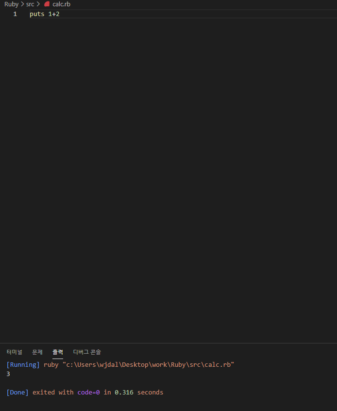

# 시작하기

## window 버전
[download 하로가기.](https://www.ruby-lang.org/en/downloads/)

</img><br/>

Download 사이트로 접속해서 본인에게 맞는 버전을 다운로드 한다.
(튜토리얼에서는 3.0 버전으로 진행하기 때문에 3.0버전으로 진행)

</img><br/>

편집기는 VS Code를 사용합니다.

cmd 창을 열어서 ruby -v 를 입력해보세요. 다음과 같이 나오면 설치가 완료된 것입니다.

```
ruby 3.0.0p0 (2020-12-25 revision 95aff21468) [x64-mingw32]
```

## vs code 설정
- Ruby
- Ruby Solargraph
- VSCode Ruby

다음 패키지들을 다운받은되 <string>파일이름.rb</strong> 으로 파일을 생성후 run code를 실행합니다.

Ctrl + Alt + N 을 이용해서 코드를 실행합니다.

<br>

## 실행화면

