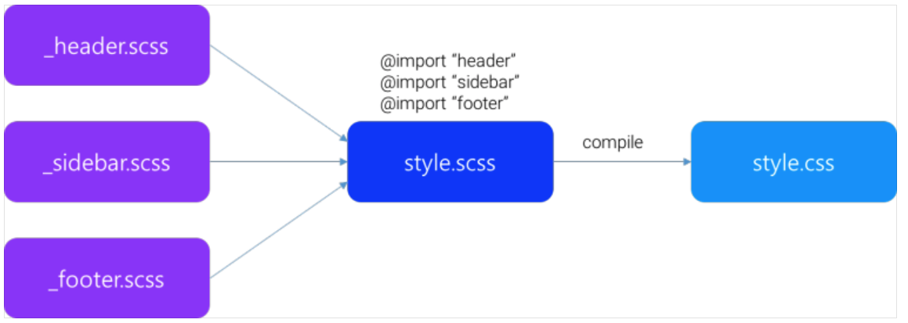
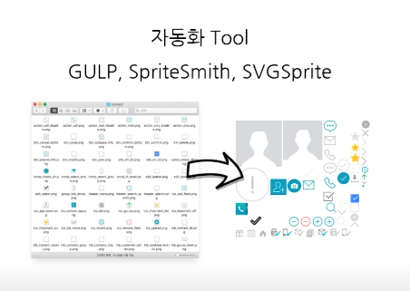

# SSAS

SSAS는 CSS PREPROCESSOR의 하나의 종류입니다.(전처리기)<br>
브라우저에서 바로 읽을 수 있습니다. 문법오류나 오탈자가 있는 경우 알려줍니다.<br>
반복적인 기능을 자동화 하는데 도움을 줍니다.

SSAS : <mark> Syntactivally Awesome Sylesheets </mark>

## 장점
- CSS COMPATIBLE
- INDUSTRY APPROVED 
- FEATURE RICH 
- LARGE COMMUNITY
- MATURE <em>개발된지 12년 되었습니다.</em>
- FRAMEWORKS

```
// scss, Sassy CSS
ul {
  li {
    display: block;				    
  }
}

// sass
ul 
  li 
    display: block					

// Compiled CSS
ul li {
  display: block;
}
```

## 설치하기 NODEJS/NPM 이용

nodejs.org 로 접속해 LTS버전을 다운로드합니다.
<br>
설치가 완료되었으면 다음 명령어를 확인합니다
```
$ node -v
v14.15.5
```
```
$ npm -v
6.14.11
```

## npm을 이용한 saas설치
```
$ (sudo) npm install -g sass
```

## 설치 후 버전 확인
```
$ sass --version
1.32.7 compiled with dart2js 2.10.5
```

## 사용하기
```
// 컴파일 결과이름이랑 같은 경우
$ sass input.scss
// 이름을 따로 설정하고 싶은 경우
$ sass input.scss ouput.css
```

### 옵션추가시 scss파일을 컴파일 할때마다 css파일을 생성합니다.
```
$ sass --watch input.scss:output.css
```

### 스타일 포맷을 설정 (기본값 expanded)
```
--style [expanded, compressed]
```

### source-map 사용 (기본)
### source-map 미사용 (--no-source-map)

# 시작하기

## @IMPORT



동영상 목차 스크립트 
SASS 기초

강의 소개

HTML/CSS에 대한 기본적인 지식
조건문, 반복문 등 기초 프로그래밍 지식
기능을 숙지하고 사용해보는 것에 중점
 

 이해하기

CSS Preprocessor란?

- 별도의 컴파일과정을 통해 CSS의 기능을 확장하고, 반복적인 작업을 자동화 하게 도와 주는 툴

SASS ( Syntactically Awesome Stylesheets )

CSS 호환성
많은 실무 사용 사례
풍부한 기능
다양한 커뮤니티와 공유 활동
오랜 기간동안 운영/개발 되어진 완성도
다양한 프레임워크
SASS의 문법
```
// scss, Sassy CSS
ul {
  li {
    display: block;				    
  }
}

// sass
ul 
  li 
    display: block					

// Compiled CSS
ul li {
  display: block;
}
```
## 설치하기

NODEJS/NPM설치

https://nodejs.org 에서 nodejs LTS 버전 설치

nodejs 설치 시 npm도 함께 설치됩니다.
```
// 터미널에서 node 버전 확인으로 설치가 잘 되었는지 확인.
$ node -v
v9.3.0
```
```
$ npm -v
5.6.0
```
## SASS설치

### npm 을 이용하여 sass를 설치.
```
// npm을 이용하여 sass 설치
$ (sudo) npm install -g sass

// sass 버전 확인
$ sass --version
1.9.0 compiled with dart2js 2.0.0-dev.67.0
``` 

### Command-line tool을 이용하여 SASS 사용하기 
```
// 기본 사용법 
$ sass input.scss:output.css

// --watch 옵션 추가시 수정될 때마다 자동으로 css 컴파일
$ sass --watch input.scss:output.css
```
### --style [expanded, compressed]

컴파일된 CSS파일의 formatting style을 지정.

expanded는 풀어쓴 형태, compressed는 minify된 형태

 

### --source-map

기본값은 소스맵을 사용함으로 설정 됨.

컴파일시 CSS파일 최하단에 소스맵 맵핑파일의 이름이 주석으로 추가되고, CSS파일명과 동일한 이름의 .map 파일이 추가 생성.

요소검사툴에서 style 확인시 scss파일명과 행번호를 표시해주어 디버깅을 용이하게 해줍니다.

 ``` 

// output.css
.section{background:#fff}.section .title{color:green}.section .description{text-align:center}
/*# sourceMappingURL=output.css.map */
 
```
### 시작하기

@import

CSS의 @import 구문과 유사한 형태로 사용되지만, 차이점은 Sass에서의 @import는 컴파일 단계에서 파일을 불러와 하나의 CSS로 파일이 합쳐집니다. scss파일을 모듈 또는 레이아웃 기준으로 분리하여 css 구조화를 할수 있습니다.

```
// _espresso.scss
@import 'espresso'; // 파일명 첫번째 언더바(_) 생략 가능
@import 'espresso.scss'; // 확장자는 생략 가능

@import 'scss/espresso'; // 하위 폴더 지정
@import 'espresso', 'reset', 'common'; // 여러개 파일 import
```

## Nesting (중첩)
자식 선택자를 부모 선택자 블럭 안에 중첩하여 쓸수 있는 확장된 문법.
<br>
부모 선택자를 반복해서 쓰지 않아도 되고, 가독성이 더 뛰어나며 구조화된 느낌의 코드를 작성할 수 있습니다.

```
// scss 
.section {
	background: white;

	.title {
		color: green;
	}
	.description {
		text-align: center;
	}
	.description_list {
		margin: 20px 0;
		padding: 20px;
		border: 1px solid gray;
		dd {
			font-size: 15px;
			line-height: 20px;
		}
	}
}
// CSS 
.section{background:white}
.section .title{color:green}
.section .description{text-align:center}
.section .description_list{margin:20px 0;padding:20px;border:1px solid gray}
.section .description_list dd{font-size:15px;line-height:20px}
```

## Bad CASE
```
// Bad CASE
// scss 
nav {
	ul {
		margin: 0;
		li { 
			display: inline-block; 
			a {
				display: block;								
			}
		}
	}
}
// CSS 
nav ul {
	margin: 0;					
}
nav ul li {
	display: inline-block;
}
nav ul li a {
	display: block;					
}
```

## Good CASE
```
// Good CASE
// scss 
nav {
	ul {
		margin: 0;
	}
	li { 
		display: inline-block; 
	}

	a {
		display: block;        
	}
}

// CSS 
nav ul {
	margin: 0;
}
nav li {
	display: inline-block;
}
nav a {
	display: block;
}
```

## & ( Referencing Parent Selectors, 부모 참조 셀렉터 )
블럭 안에 엠퍼센드를 추가하여, 차상위 셀렉터(부모 셀렉터)를 참조하는 형태의 셀렉터
```
// scss
a {
	font-weight: bold;
	text-decoration: none;

	&:hover {
		text-decoration: underline;
	}
}

// CSS
a {
	font-weight: bold;
	text-decoration: none; 
}
a:hover {
	text-decoration: underline; 
}
```
다양한 셀렉터 형태로 사용이 가능합니다.
```
// scss
.espresso {
	color: red;

	&:hover {
		color: orange; // 가상 클래스
	}
	&::after {
		color: yellow; // 가상 요소
	}
	&[id="text"] {
		color: green; // 속성 선택자
	}
	&.americano {
		color: blue; // 클래스 선택자
	}
	&#cappuccino {
		color: purple; // 아이디 선택자
	}
}

// CSS
.espresso{color:red}
.espresso:hover{color:orange}
.espresso::after{color:yellow}
.espresso[id="text"]{color:green}
.espresso.americano{color:blue}
.espresso#cappuccino{color:purple}
```
단순 부모 셀렉터명만 가져오는것이 아닌, 네스팅된 모든 셀렉터를 가져옴을 주의해야 합니다

```
// scss
.espresso {
  color: red;

  .cappuccino {
    color: orange;
	
    .latte {
      .a_class {
        .b_class {						
          &.last { // 깊은 중첩에서의 부모 참조 선택자
            color: yellow;
          }						
        }
      }
    }
  }
}

// CSS
.espresso { color: red; }
.espresso .cappuccino { color: orange; }				
.espresso .cappuccino .latte .a_class .b_class.last { color: yellow; }
```
엠퍼센드(&)의 위치에 따라 다른 사용법도  가능합니다.
```
// 접미사로 사용한 예시
// scss
.latte {
	.cappuccino & {
		font-size: 11px;
	}
}

// CSS
.cappuccino .latte { font-size:11px }


// 접두사로 사용한 예시, BEM 지원
// scss
.give_me_a {
	&-espresso {
		color: red;
	}
	.please &-americano {
		color: orange;
	}
}

// CSS
.give_me_a-espresso{color:red}
.please .give_me_a-americano{color:orange}
```

## $Variables
사스의 변수는 $를 변수명 앞에 붙임으로 선언이 가능합니다.
```
// scss
$color-normal: #666;
$color-point: #f00;

a {
	color: $color-normal;

	&:hover {
		color: $color-point;
	}
}

// CSS
a { color: #666; }
a:hover { color: #f00; }
```
사스의 변수도 지역 변수와 전역 변수라는 개념을 가지고 있습니다.
<br>
최상위에 선언시 전역변수로, CSS 룰셋 블럭 안에 선언시 해당 블럭안에서만 유효한 지역변수로 동작하게 됩니다.
```
// scss
$size: 10px;

.latte {
	$size: 12px;				
	width: $size;

	.americano {
		width: $size;
	}
}
.cappuccino {				
	width: $size;
}

// CSS
.latte { width:12px }
.latte .americano { width:12px }
.cappuccino { width:10px }
```
예외적으로, 블럭안에 선언한 변수일 지라도  !global 플래그를 이용하여 전역변수로 선언이 가능 합니다. 
```
// scss
$size: 10px;

.latte {
	$size: 12px !global;				
	width: $size;

	.americano {
		width: $size;
	}
}
.cappuccino {				
	width: $size;
}

// CSS
.latte { width:12px }
.latte .americano { width:12px }
.cappuccino { width:12px }
```
변수의 타입

- 숫자 1, 1.5, 10px
- 문자열 "foo", 'bar', baz
- 색상 blue, #04a3f9, rgba(255,0,0,0.5)
- 불리언 true, false
- 널 null
- 리스트 1.5em 1em 0 2em, Arial, sans-serif
- 맵 (key1: value1, key2: value2)
- function 참조 round(1.5)

## Interpolation #{ }
interpolation을 이용하여 변수를 셀렉터명이나 속성명에도 사용할 수 있습니다.
```
// scss
$name: foo;
$attr: border;

p.#{$name} {
	#{$attr}-color: blue;
}

// CSS
p.foo {
	border-color: blue; 
}
```

## Mixin 과 @Include
자주 사용하는 css 패턴이나, 재사용을 위한 css 구문을 mixin으로 작성하고,

작성된 mixin을 @include를 이용하여 불러옵니다.
```
@mixin ellipsis-text {
	text-overflow: ellipsis;
	overflow: hidden;
	white-space: nowrap;
	max-width: 100%;
}

.text {
	@include ellipsis-text;
	color: #f00;
}

// CSS
.text {
	text-overflow: ellipsis;
	overflow: hidden;
	white-space: nowrap;
	max-width: 100%;
	color: #f00;
}
```
mixin은 selector를 포함한 룰셋 전체를 선언하는것도 가능하고, 

또 다른 mixin을 include하는것도 가능합니다.

```
// 룰셋을 포함하는것도 가능
@mixin silly-links {
	a {
		color: blue;
		background-color: red;
	}
}						
@include silly-links;

// 다른 mixin을 포함할 수도 있음.
@mixin compound {
	@include highlighted-background;
	@include header-text;
}

@mixin highlighted-background { background-color: #fc0; }
@mixin header-text { font-size: 20px; }
```

## Arguments
mixin명 뒤에 괄호로 인자값 전달이 가능합니다.
```
@mixin border($color, $width) {
	border-color: $color;
	border-width: $width;
	border-style: solid;	
}

p { @include border(blue, 2px); }
```
인자의 기본값을 설정하면, include시 기본값이 설정된 인자는 생략할 수 있습니다.
<br>
또한, 인자의 키워드명을 명시함으로써 인자의 순서를 다르게 전달 할 수도 있습니다. 
```
// 인자의 기본값 설정
@mixin border($color, $width: 1px) {
	border: {
		color: $color;
		width: $width;
		style: solid;
	}
}

// 키워드 인자
p { @include border($width: 2px, $color: red); } 
```
복수 인자(...)로 지정시 list 타입형태로 인자의 갯수에 영향을 받지 않고 전달 받는 것도 가능합니다.
```
// 복수 인자
@mixin margin($variable...) {
	margin: $variable;
}

p { @include margin(5px) }
p { @include margin(5px 5px) }
p { @include margin(5px 5px 5px) }
p { @include margin(5px 5px 5px 5px) }
```
## @content
이전 믹스인의 형태와 달리 컨텐츠 블록을 믹스인에 통으로 전달하는 형태. 
<br>
미디어 쿼리문을 작성할 때 유용하게 사용할 수 있습니다.

```
// 컨텐츠 블록을 믹스인에 전달
@mixin mq {
	@media all and (max-width:600px) {
		@content;
	}
}

.mixin_media {					
	background-color: pink;
	@include mq {
		background-color: green;
	}
}

// CSS
.mixin_media {
	background-color: pink;
}
@media all and (max-width: 600px) {
	.mixin_media {
		background-color: green;
	}
}
```

## @extend와 %placeholder
목적성에서 mixin과 유사한 점도 있으나, 기존 클래스의 CSS 룰셋을 확장한다는 개념입니다.
```
// scss
.americano {
	font-size: 12px;
	text-align: center;
	color: #fff;
	background-color: red;
}
.americano_ice {
	@extend .americano;
	background-color: blue;
}

// CSS
.americano, .americano_ice {
	font-size: 12px;
	text-align: center;
	color: #fff;
	background-color: red;
}
.americano_ice {
	background-color: blue;
}
```
## %placeholder selector
extend를 위한 가상의 룰셋 생성을 위한 셀렉터. CSS에서는 존재하지 않는 셀렉터의 종류이기 때문에, 컴파일시 노출되지 않습니다.
```
// scss
%water {
	font-size: 12px;
	text-align: center;
	color: #fff;
}
.americano {
	@extend %water;
	background-color: red;
}
.americano_ice {
	@extend %water;
	background-color: blue;
}

// CSS
.americano, .americano_ice {
	font-size: 12px;
	text-align: center;
	color: #fff;
}
.americano { background-color: red; }
.americano_ice { background-color: blue; }
```

## extend의 한계
 자식선택자, 인접선택자를 사용하여 extend 할수 없습니다.
 ```
 // scss
// 자식선택자, 인접선택자는 extend 할수 없음.				
.latte_1 {
	@extend .americano .espresso;
}

.latte_2 {
	@extend .americano + .espresso;
}

 ```
 미디어 구문안에서 extend 사용시에 블럭 밖의 클래스를 확장할수 없습니다
 ```
 // scss
.espresso {
	background-color: #391919;
}
@media print {
	.latte {
		@extend .espresso;

		color: #887e61;
	}
}
// Error 
Error: You may not @extend an outer selector from within @media.
You may only @extend selectors within the same directive.
 ```
