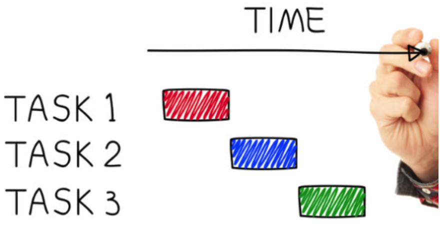
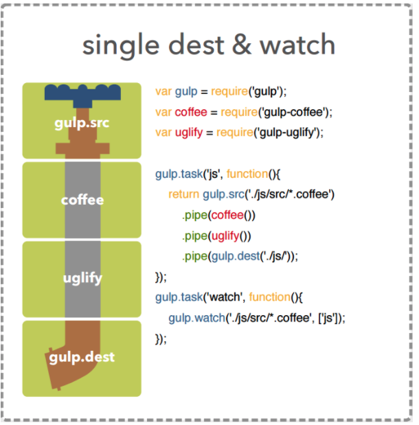
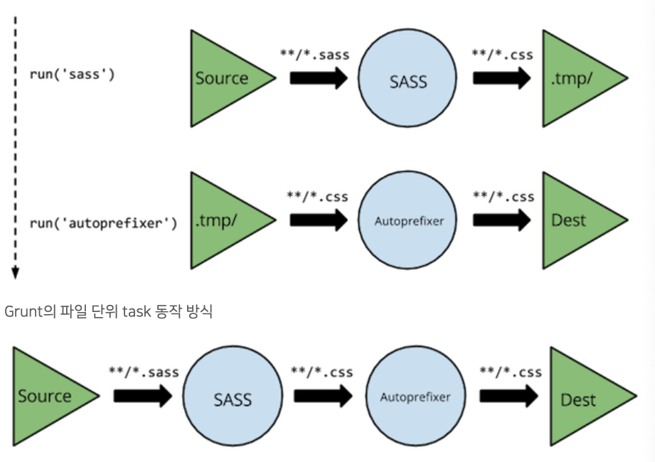

# TaskRunner


여러 기반의 TaskRunner들이 있으나 가벼움과 환경구축의 편리함으로 node.js 기반의 TaskRunner들이 많다.
- Robo (PHP)
- Rake (ruby)
- Blade (lua)
- Grunt (Node.js)

# Wiht is Node.js?
- 서버사이드에서 동작이 가능한 Javascript
- 확장성 있는 네트워크 애플리케이션(특히 서버 사이드) 개발에 사용되는 소프트웨어 플랫폼
- Multi Thread가 아닌 이벤트 기반 비동기 방식(non-blocking IO)

# NPM
- Node Packaged Modules
- node.js 에서 사용되는 모듈을 패키지로 모아놓고 이를 관리해주는 툴
- package.json에 의존 모듈로 관리합니다.

# Gulp
- streaming bulid systems
- v3.9.1 Release
- 문법적으로 쉽고, stream 기반으로 빠르다.
## Grunt의 파일 단위 task 동작 방식

## Gulp의 스트리밍 task 동작방식


# 기본적인 gulp 사용법
gulp의 기본적인 사용 API는 아래 4개가 있습니다.
- gulp.src(globs[,options])
- gulp.dest(path[,options])
- gulp.task(name[,deps],fn)
- gulp.watch(glob[,opts],tasks) 또는 gulp.watch(glob[,opts,cb])
상세한 API의 설명은 API 참조문서 https://github.com/preco21/gulp-docs-ko/blob/master/API.md

## gulp.src(globs[,options])
- 대상이 되는 파일을 지정합니다.
- globs
  - node-glob 문법을 이용하여 파일을 수정합니다.
  - 문장 혹은 배열로 표현할 수 있습니다.
  - EX
    - "**/*.css"
    - "[**/*.css","**/*.html]
  - optinos
    - node-glob 옵션 및 추가 옵션을 설정합니다.
    - 주로 많이 쓰는 옵션은 <mark>options.base</mark>입니다.

## gulp.dest(path[,options])
- 작업이 적응된 파일을 내보냅니다.
- path
  - 결과를 내보낼 위치를 정합니다.
  - 문장으로 표현합니다.
- optinos
  - 관련 옵션을 정합니다.

## gulp.task(name[,deps],fn)
- 태스크를 만듭니다.
- name
  - 태스크의 이름을 지정합니다.
- deps
  - 해당 태스크가 실행되기 이전에 실행되어야 할 태스크를 지정합니다
  - 배열로 표현합니다.
- fn
  - 태스크의 상세 내용을 정합니다
  - 함수로 표현합니다.

## gulp.watch(glob[,opts],tasks) 또는 gulp.watch(glob[,opts,cb])
- 지정한 파일을 감시하여 지정된 태스크나 함수를 실행합니다.
- glob
  - gulp.src 의 glob과 같습니다.
- opts
  - watch를 위해 사용되는 gaze 모듈과 관련된 options을 설정할 수 있습니다.
- tasks
  - 실행되는 태스크를 배열로 표현합니다.
- cb
  - 실행되는 함수를 표현합니다.

# 실습
## node.js 설치 (버전확인 없으면 설치)
```
node -v
```

## gulp-cli 설치
```
sudo npm install -g gulp-cli
```
npn init 명령어를 통해서 pacakge.json 생성

## pakage.json에 모듈 추가, 제거
```
npm install --save-dev 모듈명
//gulp 설치 시
npm install --save-dev gulp@3.9.1
```
제거는 아래와 같다.
```
npm uninstall --save-dev 모듈명
gulp 제거 시
npm uninstall --save-dev gulp
```

## gulp 모듈 설치
gulp-cli는 단순히 gulp를 쉽게 실행하게 해주는 모듈이며 실제 동작하는 gulp 모듈은 프로젝트 폴더에 설치를 해야 합니다.
<mark> node 12버전부터는 ,gulp4.0.0 이상부터 호환됩니다.</mark>
```
npm install --save-dev gulp@3.9.1
```

## gulpfile.js
gulpfile.js에 다음과 같은 텍스트를 입력한다.
```
var gulp = require('gulp');

gulp.task('copy',function(){
    return gulp.src('*.txt')
    .pipe(gulp.dest('test/'));
});
```

이제 gulp copy라는 명령어를 통해서 return gulp.src를 할 수 있음.. (명령프롬포트 상에서 가능)

```
gulp copy
```
gulpfile.js와 같은 디렉토리 내의 txt라는 확장자를 가진 모든 파일을 test 디렉토리로 복사하는 task 입니다.
<br>
이와 같이 gulp의 한 흐름을 return하는 방식으로 task를 만들 수 있습니다.
<br>

## <mark>gulp-sass 모듈 사용하기 </mark>
libsass를 이용하여 node.js 방식으로 제작된 node-sass를 gulp로 이용할 수 있게 만든 gulp-sass를 이용하여 sass 파일을 css로 변환하는 task를 만들어 봅시다.
<br>
먼저 gulp-sass(https://github.com/dlmanning/gulp-sass) 모듈을 설치합니다.

```
npm install --save-dev gulp-sass
```

## autoprefixer 모듈 사용하기
- autoprefixer는 prefix가 필요한 css property에 자동으로 prefix를 붙여주는 모듈입니다.
- 먼저 모듈을 설치합니다. 사용할 모듈은 gulp-autoprefixer(https://github.com/sindresorhus/gulp-autoprefixer) 입니다.

```
npm install --save-dev gulp-autoprefixer
```

테스트를 위해서 다음과같은 scss 파일을 준비합니다.
```
.test_wrap {
    text-align: left;

    .test {
        font-size: 12px;
        transform: rotate(45deg);
    }
}
```

이어서 gulpfile.js 에 변수를 추가하고 sass명령어를 수정합니다.
```
var autoprefixer = require('gulp-autoprefixer');

gulp.task('sass', function() {
    return gulp.src('scss/*.scss')
        .pipe(sass())
        .pipe(autoprefixer({ // autoprefixer 추가
            browsers: ['chrome > 0', 'ie > 0', 'firefox > 0']
        }))
        .pipe(gulp.dest('css/'));
});
```
autoprefixer의 옵션은 테스트를 위해 넣은 것이며 실제 사용시에는 프로젝트에 맞는 옵션을 넣습니다.
<br>
gulp를 이용하여 sass task를 다시 실행한 후 동작을 확인합니다.

```
gulp sass
```

실행시키면 다음과같이 pre-fix가 붙어서 알아서 브라우저별 대응해줍니다.
```
.test_wrap {
  text-align: left; }
  .test_wrap .test {
    font-size: 12px;
    -webkit-transform: rotate(45deg);
       -moz-transform: rotate(45deg);
        -ms-transform: rotate(45deg);
            transform: rotate(45deg); }
```

## spritesmith를 이용하여 sprite를 만들어 보기인지
spritesmith는 sprite 조각 이미지를 하나의 판으로 만든 후 css, sass 등에서 사용하기 쉽도록 해주는 모듈입니다.
<br>
먼저 모듈을 설치합니다. 사용할 모듈은 gulp.spritesmith(https://github.com/twolfson/gulp.spritesmith) 입니다.

```
npm install --save-dev gulp.spritesmith
```
스프라이트를 만들고싶은 이미지 디렉토리를 설정합니다

```
var spritesmith = require('gulp.spritesmith');
gulp.task('sprite', function() {
    var spriteData = gulp.src('sprites/*.png')
        .pipe(spritesmith({
            imgName: 'sprite.png',
            cssName: '_sprite.scss',
            imgPath: '../img/sprite.png'
        }));
    var imgStream = new Promise(function(resolve) {
        spriteData.img
            .pipe(gulp.dest('img/'))
            .on('end',resolve);
    });
        
    var cssStream = new Promise(function(resolve) {
        spriteData.css
            .pipe(gulp.dest('scss/'))
            .on('end',resolve);
    });

    return Promise.all([imgStream, cssStream]);
});
```

다음과 같이 생성된 sprite파일을 사용합니다.
```
@import 'sprite';

...

.icon_account {
    @include sprite($account);

    display: inline-block;
}
.icon_check_circle {
    @include sprite($check_circle);

    display: inline-block;
}
.icon_delete {
    @include sprite($delete);

    display: inline-block;
}
```
gulp sass명령어를 이용해서 다시 빌드하면 sprite이미지가 추가된걸 확인할 수 있습니다.

## imgemin을 이용하여 sprite 이미지 용량 줄이기
```
npm install --save-dev gulp-imagemin vinyl-buffer
```

js에 다음과같이 추가해줍니다.
```
var imagemin = require('gulp-imagemin');
var buffer = require('vinyl-buffer');
var spritesmith = require('gulp.spritesmith');
gulp.task('sprite', function () {
    var spriteData = gulp.src('sprites/*.png')
        .pipe(spritesmith({
            imgName: 'sprite.png',
            cssName: '_sprite.scss',
            imgPath: '../img/sprite.png'
        }));
    var imgStream = new Promise(function (resolve) {
        spriteData.img
            .pipe(buffer())
            .pipe(imagemin())
            .pipe(gulp.dest('img/'))
            .on('end', resolve);
    });

    var cssStream = new Promise(function (resolve) {
        spriteData.css
            .pipe(gulp.dest('scss/'))
            .on('end', resolve);
    });

    return Promise.all([imgStream, cssStream]);
});
```

gulp sprite를 이용하여 동작을 확인합니다

## browser-sync와 watch 이용하기
browser-sync를 이용하면 sass 파일이 수정되어 css가 새로 생성될때 브라우저를 새로고침하지 않고 바로 적용된 화면을 보거나 html 파일이 수정되면 자동으로 새로고침을 시키는 등 작업 효율을 올릴 수 있습니다.

```
npm install --save-dev browser-sync
```

테스트용 index.html 을 생성합니다.
```
touch index.html
```

js파일을 수정합니다.

먼저 sass task가 동작된 후 css를 갱신할 수 있도록 sass task를 수정합니다.
```
gulp.task('sass', function() {
    return gulp.src('scss/*.scss')
        .pipe(sass())
        .pipe(autoprefixer({
            browsers: ['chrome > 0', 'ie > 0', 'firefox > 0']
        }))
        .pipe(gulp.dest('css/'))
        .pipe(browserSync.stream({match:'**/*.css'})); // broswer-sync로 전송 추가
});
```

그리고 다음을 추가합니다.
```
var browserSync = require('browser-sync');
gulp.task('browser-sync', function() {
    browserSync.init({
        server: {
            baseDir: "./"
        }
    });
});
// 다음은 파일이 수정 될 경우 자동으로 인식하고 동작하도록 watch task를 만듭니다.
gulp.task('watch',['browser-sync'],function() {
    gulp.watch('scss/*.scss',['sass']);
    gulp.watch('*.html').on('change', browserSync.reload);
});
```
watch task를 주로 사용하기 편하도록 default task로 지정합니다.
```
gulp.task('default',['watch']);
```


<mark>gulp 4.0이상부터 문법이 바뀌었습니다.</mark>
### BEFORE
```
gulp.task('start', ['run','build','watch']);
```
### AFTER
```
gulp.task('start', gulp.series(['run','build','watch']));
```
```
gulp.task('watch',gulp.series(['browser-sync']),function() {
    gulp.watch('scss/*.scss',['sass']);
    gulp.watch('*.html').on('change', browserSync.reload);
});

gulp.task('default',gulp.series(['sass']));
```