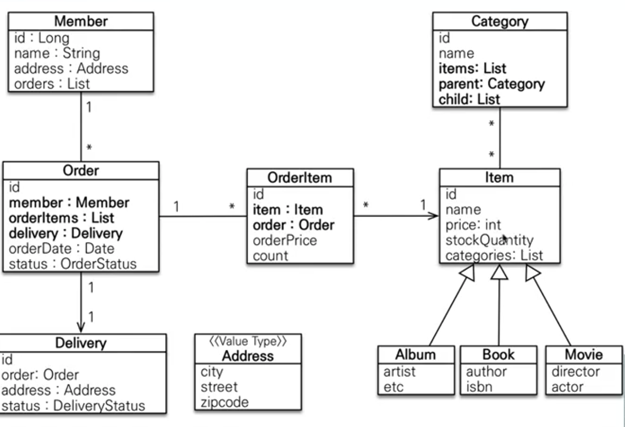
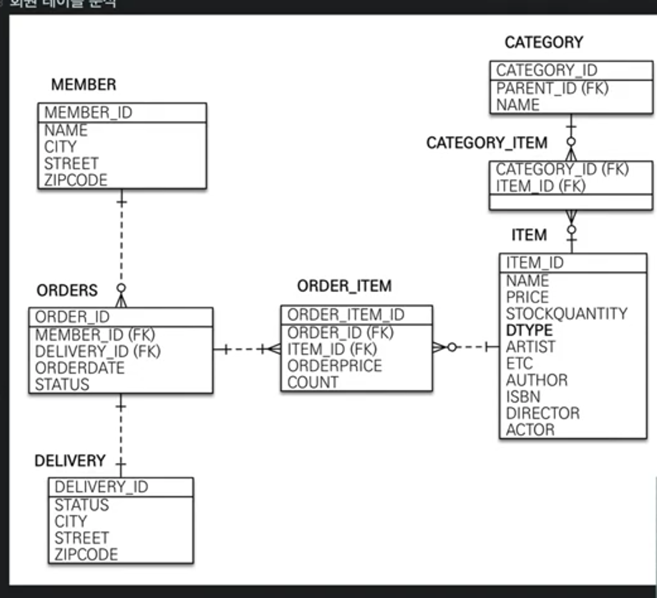

# Open-Session-in-view

spring-.jpa.open-in-view: true 기본값

이 기본값을 뿌리면서 애플리케이션 시작 시점에 warn 경고를 남긴다.

영속성을 끝까지들고있는다.. 근데 컨트롤에서 외부 에피아이가 오래걸리면 그만큼 db리소스를 들고있어야되는 손해다.

엔티티를 활용해서 LAZY를 활용할 수 있는 엉첨난 장점이 있다.

spring.jpa.open-in-veiw: false
- OSIV를 끄면 트랜잭션을 종료할 때 영속성 컨텍스트를 닫고, 데이터베이스 커넥션도 반환한다. 따라서 커넥션 리소스를 낭비 하지 않는다.
- 트랜재션이 끝나는 순간 영속성을 반환해서 LAZY로딩이 안됨. 그래서 강제하는 방법이 필요합니다.( 트랜잭션이 끝나기전에 지연로딩을 강제로 호추해야한다.)
- 이걸 해결하기 위한 무수한 방법이 있음
    - controller에 있는 애를 따로 class (Tranjactional)을 관리하는 곳에서 처리한다.
    - 커맨드와 쿼리 분리

그래서 HOW?
- 고객 서비스의 실시간 API는 OISV를 끄고, ADMIN 처럼 커넥션을 많이 사용하지 않는 곳에서는 OSIV를 켠다.

# Spring-DATA_JPA
- JPA알고 쓰면 좋다~

# QueryDSL 소개
http://www.querydsl.com

- 실무에서는 조건에 따라서 실행되는 쿼리가 달라지는 동적쿼리가 필요하다
- 자바코드로 처리한다 ....
